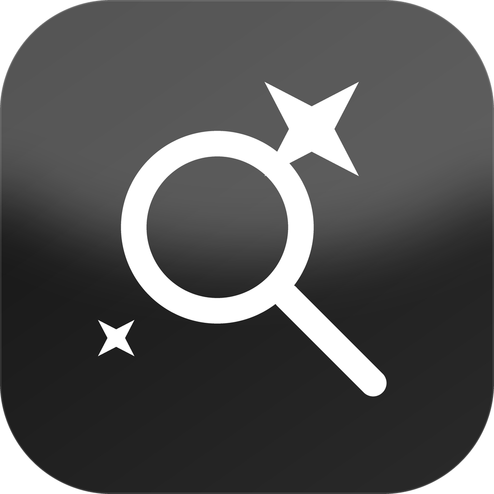

  

# Glint

**A fast, glassy, endlessly customisable launcher for macOS.**

Glint is a lightweight Spotlight alternative: a single global hotkey opens a
floating, Liquid Glass search panel that finds apps, files, and does quick
math — with almost every visual and behavioural detail exposed in Settings.

## Why Glint

- **Lightweight** — no background indexing daemon of its own. It reuses
  macOS's existing Spotlight index (`NSMetadataQuery`) for files, and caches
  a plain in-memory list of installed apps refreshed every couple of
  minutes. Idle CPU/RAM footprint is close to zero.
  
- **Looks like Spotlight, feels like yours** — the same centered, borderless,
  floating panel shape, but corner radius, tint colour, glass intensity,
  width, font family, font size, and vertical position are all adjustable in
  Settings.
  
- **Real Liquid Glass** — on macOS 26 and later, the panel uses Apple's
  actual `.glassEffect` material via SwiftUI. On earlier macOS versions it
  falls back to a tinted `NSVisualEffectView` that approximates the look.
  
- **Custom fonts** — pick from a curated list, or click "Browse System
  Fonts…" to open the standard macOS Font Panel and use anything installed
  on your Mac.
  
- **Custom icon** — comes with a hand-drawn monochrome app icon
  (`Resources/AppIcon.icns`, already wired into the Xcode-free build), plus
  a menu-bar icon changer in Settings → Icon: pick from eight built-in SF
  Symbols or import your own image.
  
- **Pluggable search** — every source (apps, files, calculator, system
  commands, web search) is a small `SearchProvider`. Toggle any of them off,
  or drop in your own by conforming to the protocol in `Models.swift` and
  registering it in `SearchEngine.swift`.
  
- **No accessibility permission required** — the global hotkey uses the
  classic Carbon `RegisterEventHotKey` API, not a CGEventTap, so there's no
  scary permission prompt on first launch.
